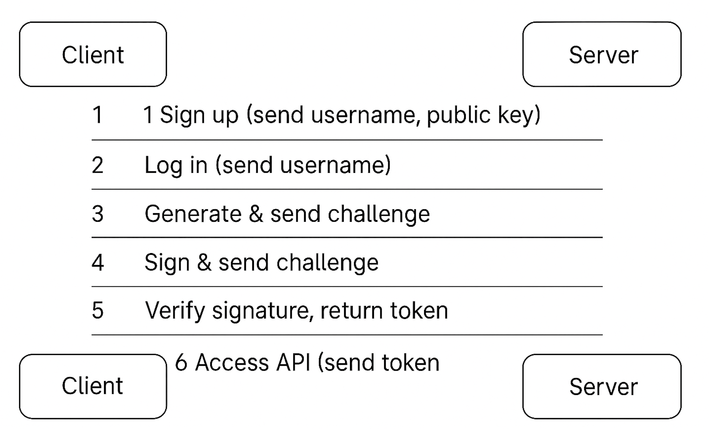
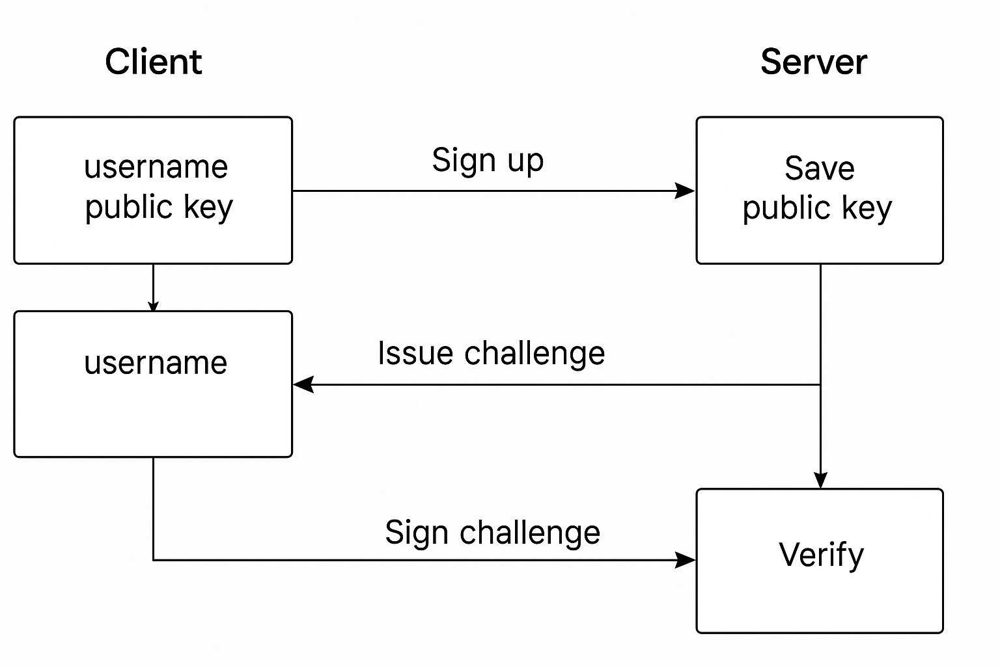

# authlite

authlite is a lightweight, modular authentication system that enables secure, passwordless user login using public-key cryptography and challenge-response signatures.

It is designed for developers who require secure, simple, and easily integratable authentication mechanisms in Java-based applications.

## Features

- Passwordless login using ECDSA-based challenge-response
- Public key-based signup and verification
- Stateless JWT token-based authentication
- Testable with a fake in-memory server (no real HTTP setup required)
- PostgreSQL-backed user persistence
- Modular design for integration into other systems

## TODO

- [ ] Seperate Client and Server Modules.
- [ ] Persist challenges across server restarts.
- [ ] Implement key rotation and revocation mechanisms.
- [ ] Provide refresh token support.
- [ ] Add logout endpoint with JWT invalidation (optional).
- [ ] Build an Android-compatible client library.
- [ ] Implement rate limiting and brute force protections.
- [ ] Add user profile storage beyond public key.

## Table of Contents

- [Overview](#overview)
- [Architecture](#architecture)
- [Current Project Structure](#current-project-structure)
- [Final Expected Structure](#final-expected-structure)
- [Technology Stack](#technology-stack)
- [How It Works](#how-it-works)
  - [Signup Flow](#signup-flow)
  - [Login Flow](#login-flow)
- [Installation](#installation)
- [Usage Example](#usage-example)
- [License](#license)

## Overview

authlite provides a passwordless authentication mechanism using digital signatures.  
It relies on public-private key cryptography and a challenge-response protocol to securely verify user identity.  
While inspired by zero-knowledge ideas, it does not implement formal ZKPs.

## Architecture

**Client Side**
- Key generation and secure private key storage
- Public key sharing at signup
- Challenge signing during login
- Secure communication (abstracted via HTTP client)

**Server Side**
- Public key registration and secure storage
- Challenge generation and lifecycle management
- Signature verification against stored public keys

## Current Project Structure

```
/authlite/
├── logs/
│   └── authlite.log
├── src/
│   └── main/
│       └── java/
│           └── com/
│               └── authlite/
│                   ├── client/
│                   │   ├── AuthClient.java
│                   │   ├── CryptoUtils.java
│                   │   ├── FakeNetworkClient.java
│                   │   ├── KeyManager.java
│                   │   └── NetworkClient.java
│                   └── server/
│                       ├── AuthServer.java
│                       ├── ChallengeManager.java
│                       ├── DatabaseManager.java
│                       ├── JwtUtil.java
│                       ├── UserManager.java
│                       └── TestAuthFlow.java
├── resources/
├── test/
├── README.md
├── LICENSE
└── pom.xml
```

## Final Expected Structure

```
/authlite/
├── client/
│   ├── src/main/java/com/authlite/client/
│   │   ├── AuthClient.java
│   │   ├── CryptoUtils.java
│   │   ├── KeyManager.java
│   │   ├── NetworkClient.java
│   │   └── FakeNetworkClient.java
│   ├── src/test/java/
│   └── pom.xml
├── server/
│   ├── src/main/java/com/authlite/server/
│   │   ├── AuthServer.java
│   │   ├── ChallengeManager.java
│   │   ├── DatabaseManager.java
│   │   ├── JwtUtil.java
│   │   ├── UserManager.java
│   │   └── TestAuthFlow.java
│   ├── src/test/java/
│   └── pom.xml
├── README.md
├── LICENSE
└── pom.xml (parent POM)
```

This separation will allow for independent building, publishing, and usage of the client and server libraries.

## Technology Stack

- Java 11 or higher
- ECDSA (Elliptic Curve Digital Signature Algorithm)
- PBKDF2WithHmacSHA256 for password-based key encryption
- AES for private key storage
- SecureRandom for challenge generation
- Jackson for JSON serialization/deserialization
- SLF4J for logging
- Maven for project management

## How It Works

The diagram below illustrates the challenge-response based authentication flow used during signup and login. This is not a formal Zero Knowledge Proof (ZKP), but a secure signature-based protocol using ECDSA keys.

 
  
*A visual sequence showing client-server message exchange using public-key cryptography and digital signatures for passwordless authentication*

### Signup Flow

1. **Key Generation**:  
   The client generates an ECDSA keypair (private key + public key).

2. **Signup Request**:  
   The client sends the username and public key (Base64 encoded) to the server.

3. **Server Registration**:  
   The server stores the public key associated with the username.

4. **Confirmation**:  
   The server responds confirming successful registration.

### Login Flow

1. **Challenge Request**:  
   The client sends a login request with the username to the server.

2. **Challenge Issuance**:  
   The server generates a random challenge and sends it to the client.

3. **Challenge Signing**:  
   The client signs the challenge using its private key.

4. **Signed Challenge Submission**:  
   The client sends back the signed challenge.

5. **Verification**:  
   The server verifies the signature using the stored public key.

6. **Authentication Result**:  
   Based on the verification, the server accepts or rejects the login.

## Installation

1. Clone the repository:

```bash
git clone https://github.com/Shahil3/authlite.git
```

2. Build using Maven:

```bash
cd authlite
mvn clean install
```

3. Import the modules into your Java project.

## Usage Example

### Client Side Usage

```java
KeyManager keyManager = new KeyManager();
NetworkClient networkClient = new NetworkClient();
AuthClient authClient = new AuthClient(keyManager, networkClient, "https://yourserver.com/auth");

// Register a new user
authClient.signup("your_username");

// Log 
authClient.logIn("your_username");

// Retrieve token after successful login
String token = authClient.getSessionToken();

// Use token in future authenticated requests
networkClient.getWithAuth("https://yourserver.com/profile", token);
```

### Server Side Integration

```java
UserManager userManager = new UserManager(dbHost, dbPort, dbName, dbUser, dbPassword);
ChallengeManager challengeManager = new ChallengeManager(userManager);
AuthServer authServer = new AuthServer(userManager, challengeManager);

// Parse incoming JSON into Map<String, String>
Map<String, String> request = parseIncomingJson(requestBody);
Map<String, String> response = authServer.handleRequest(request);
```

## Spring Boot Integration

You can easily integrate the authlite library into a Spring Boot project by exposing the `AuthServer` logic as an HTTP endpoint.

### 1. Add Dependencies

Make sure your Spring Boot project includes the authlite library, either via JitPack or as a local JAR:

<details>
<summary>Example using JitPack</summary>

```xml
<repositories>
  <repository>
    <id>jitpack.io</id>
    <url>https://jitpack.io</url>
  </repository>
</repositories>

<dependency>
  <groupId>com.github.Shahil3</groupId>
  <artifactId>authlite</artifactId>
  <version>main</version>
</dependency>
```

</details>

### 2. Create a Spring Controller

```java
@RestController
@RequestMapping("/auth")
public class AuthController {

    private final AuthServer authServer;

    public AuthController(
        @Value("${auth.db.host}") String dbHost,
        @Value("${auth.db.port}") int dbPort,
        @Value("${auth.db.name}") String dbName,
        @Value("${auth.db.user}") String dbUser,
        @Value("${auth.db.password}") String dbPassword
    ) {
        UserManager userManager = new UserManager(dbHost, dbPort, dbName, dbUser, dbPassword);
        ChallengeManager challengeManager = new ChallengeManager(userManager);
        this.authServer = new AuthServer(userManager, challengeManager);
    }

    @PostMapping
    public ResponseEntity<Map<String, String>> handle(@RequestBody Map<String, String> request) {
        Map<String, String> response = authServer.handleRequest(request);
        return ResponseEntity.ok(response);
    }
}
```

### 3. Configure Your Application Properties

```properties
auth.db.host=localhost
auth.db.port=5432
auth.db.name=authlitedb
auth.db.user=youruser
auth.db.password=yourpassword
```

### 4. Access from Client

Once your Spring Boot app is running, use your `AuthClient` with the real server URL:

```java
AuthClient client = new AuthClient(keyManager, new NetworkClient(), "http://localhost:8080/auth");
client.signup("alice");
client.logIn("alice");
```

The client and server are now connected over real HTTP.

## Token-Based Authentication

authlite issues a JWT (JSON Web Token) after a successful login using challenge-response signature authentication. This token:

- Encodes the user's identity and expiration time.
- Is cryptographically signed using a secret key.
- Is stateless: no server-side session storage is required.

### Using the Token

- The client receives the JWT after login.
- For future API calls, include the token in the `Authorization` header:

```
Authorization: Bearer <token>
```

- The server verifies the token and authorizes access based on it.
- Token remains valid until expiration (default 30 minutes).
- New tokens are issued upon every successful login. All valid tokens remain usable until expiry.

## Security Notes

- JWT secret key should be configured via an environment variable or config file to ensure consistency across server restarts.
- Private keys on the client side are encrypted and stored securely using AES + PBKDF2.
- All communication is expected to happen over HTTPS in real deployments.

## License

This project is licensed under the Apache License 2.0.